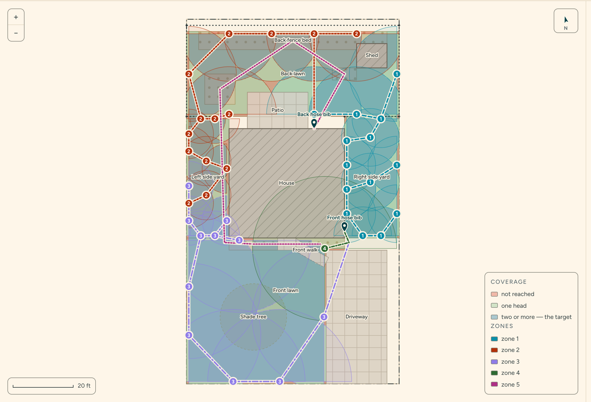
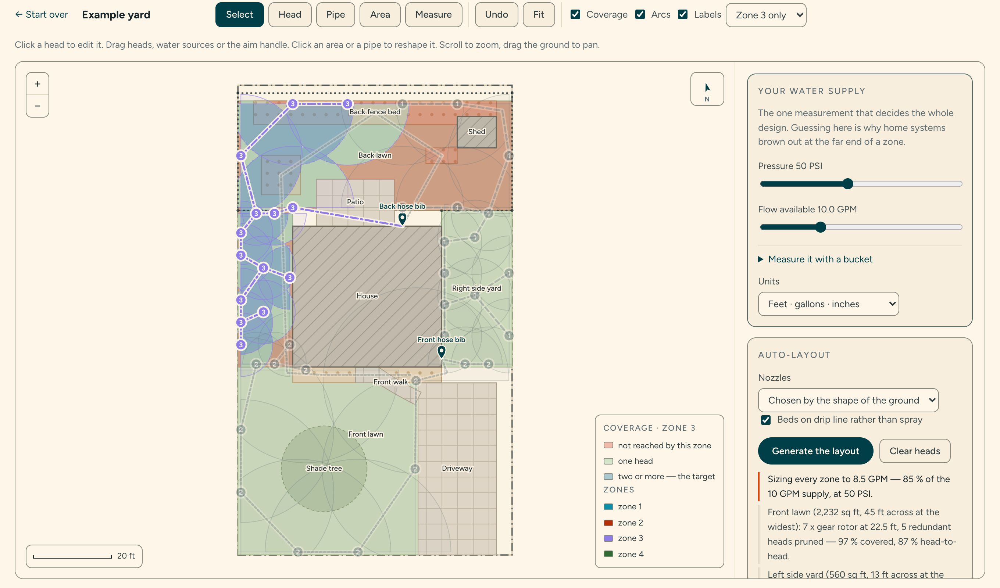

# Irrigation Lab

Plan a DIY sprinkler system for any yard. Draw the lot, say what your spigot
actually delivers, and the tool sizes the nozzles to the shape of each piece of
ground, places the heads head-to-head, packs the zones under your flow budget,
routes the trenches around the house, and prints a dig plan with a parts list.

**Try it: [irrigation.ryankm.com](https://irrigation.ryankm.com/)** — a browser,
and a bucket if you want the numbers to mean anything. EXP-039 in
[the Lab](https://ryankm.com/lab).

Vanilla JavaScript and SVG. No framework, no build step, no dependencies, no
server, no analytics, and no network call anywhere in the repository.



Any one zone can be pulled out on its own, which is how you check whether the
zone you are about to trench actually covers what it is responsible for:



Both pictures are drawn by the app's own renderer, running headlessly over the
built-in sample yard — `node scripts/make-figures.mjs` regenerates them. So they
cannot drift from what the tool actually draws.

## Quickstart

Node 20 or newer, only to serve the files — there is nothing to install.

```
npm run dev      # http://localhost:8765
npm test         # the invariants a plan has to hold to be diggable
```

Any static host will serve the directory as-is.

## Three ways to start

|  | |
|---|---|
| **The example yard** | An invented 70 × 120 ft lot. Nothing real is modelled; it exists so the solver has a non-trivial problem on the first click. |
| **A blank lot** | Enter width × depth in feet or metres and draw the yard on top of it. |
| **Your own image** | A satellite screenshot, a survey, a plot plan, a sketch on graph paper. You set the scale by clicking two points you know the distance between. The file is read straight off disk with `FileReader` and never leaves the page. |

## How the layout is solved

The interesting part is not the drawing program, it is that the plan is
*computed*. Given the polygons, the sources and the supply:

1. **Size the nozzle to the shape — and to the supply.** Each piece of ground
   is measured by the largest circle that fits inside it, sampled — the real
   "how wide is this" — rather than by its area. A 2,000 sq ft lawn and a
   2,000 sq ft side strip want completely different heads and area alone
   cannot tell them apart. Wide open ground gets gear rotors, ordinary lawns
   get rotary nozzles, narrow strips get fixed sprays. Then the throw is
   stepped down until at least three full-circle heads fit one zone's flow
   budget: on a small meter a designer runs more, smaller heads per valve, not
   one big rotor at a time. (`pickNozzle`)
2. **Ring the edge, fill the middle.** Corners first, with the arc matched to
   the interior angle and aimed down the inward bisector — computed by
   construction and then verified against the polygon, so reflex corners on an
   L-shaped lawn come out right. Then the edges as half circles facing in, then
   a triangular lattice wherever the perimeter ring cannot reach. Spacing is
   head-to-head. (`placeHeads`)
3. **Prune what earns nothing.** The corner and edge passes double up, so a
   greedy pass tries each head cheapest-first and keeps the removal only if
   coverage holds *and* head-to-head overlap barely moves. Set cover is NP-hard
   and a yard does not deserve a branch-and-bound. This drops roughly a third of
   the placements. (`pruneHeads`)
4. **Pack zones under the flow budget.** Heads are walked in a nearest-neighbour
   chain from the water source and packed greedily at 85 % of measured flow, so
   a zone is a contiguous *place* in the yard rather than a scattering, and no
   valve is sized at 100 % of a bucket test. (`chainByProximity`, `packZones`)
5. **Trench as a spanning tree.** Prim's MST per zone from its nearest source,
   with edge weights multiplied where the run would cross a building (×8) or
   paving (×1.8), so it routes around the house. A preference, not a guarantee:
   where the only path is through, the penalty is paid and the run is drawn
   honestly rather than hidden. (`trenchTree`)

Beds are handled separately, as drip rather than throw: flow from bed area at
0.6 GPH emitters on a 12 in grid, and a bed on a drip zone counts as covered
because there is no arc to model.

### Head-to-head, and why the plan looks over-watered

Every head throws far enough to reach its neighbour. On paper that looks like
absurd overlap, and it is the entire trick: a single head puts down most of its
water close in, so a layout with 100 % single coverage and no overlap browns out
in rings at the edge of every arc. The pruner is therefore scored on *both*
numbers, and the panel reports both — "covered" and "head to head".

## What it is not

Not a hydraulic design. Nozzle flow and throw are catalogue approximations
(`hydraulics.js` documents every constant and where it comes from), friction
loss along the pipe is not modelled, and nothing here knows your local code,
your backflow requirements, or where your utilities are buried. It is close
enough to size zones and argue with a parts list. It is not close enough to skip
a pressure gauge, a bucket, or a call before you dig.

## Files

| Path | What |
|---|---|
| `index.html`, `styles.css` | the page: start screen, planner, printable sheet |
| `tokens.css` | design tokens vendored from ryankm.com — never edited on this side |
| `src/geometry.js` | plane geometry in plan feet; polygons, sectors, bisectors |
| `src/hydraulics.js` | nozzle flow and throw, precipitation rate, run time, units |
| `src/site.js` | what a yard is; the three starting points; persistence |
| `src/coverage.js` | the coverage grid — one implementation, shared by the map, the solver and the tests |
| `src/autolayout.js` | the solver described above |
| `src/render.js` | the plan drawing, and the standalone SVG for print |
| `src/sheet.js` | the dig plan, head schedule and shopping list |
| `src/main.js` | screens, tools, pointer and keyboard handling, the panel |
| `tests/run.mjs` | no-dependency test runner (`npm test`) |
| `scripts/serve.mjs` | static file server for `npm run dev` |
| `scripts/make-figures.mjs` | regenerates the README figures and the OG card |

## Coordinates

One flat system, "plan feet": `x` runs left to right across the lot as you face
it from the street, `y` runs away from the street into the yard. Screen `y` is
flipped exactly once, at the render boundary. Metric display converts on the
way out; stored state is always feet and GPM.

There is no projection, no geocoding and no latitude anywhere in this
repository. That is deliberate — an earlier version of this tool modelled one
specific property, with its lot line pulled from a county parcel file and its
areas traced from a photograph of that yard. It was, structurally, a drawing of
a house rather than a program about yards, and it could not survive the lot
changing by a foot.

## Colour

Zones use a five-hue categorical palette, validated on the cream ground for the
lightness band, chroma floor, colour-vision-deficiency separation across *all*
pairs, and contrast. One pair lands at ΔE 6.6 under deuteranopia — inside the
band that is only legal with secondary encoding — so the encoding is not
optional: every head carries its zone number, every trench carries a per-zone
dash pattern, and the legend repeats both. Six all-pairs-safe categorical hues
do not exist at usable contrast, so there are five and they are never cycled; a
plan with more zones drops the extras to neutral ink and asks you to focus one
at a time, which is the better way to read a big plan anyway.

## Licence

MIT.
